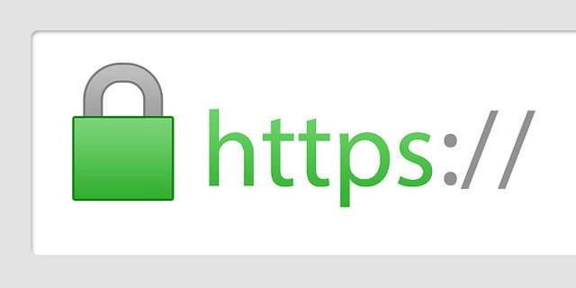
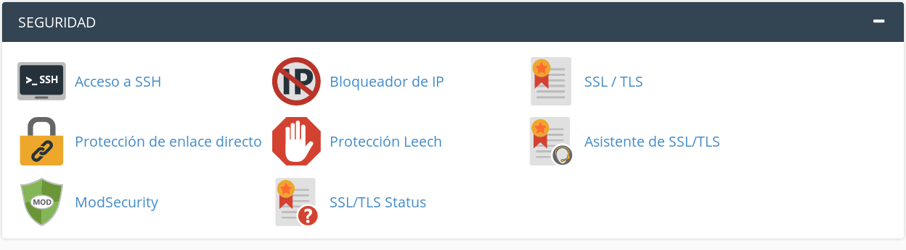
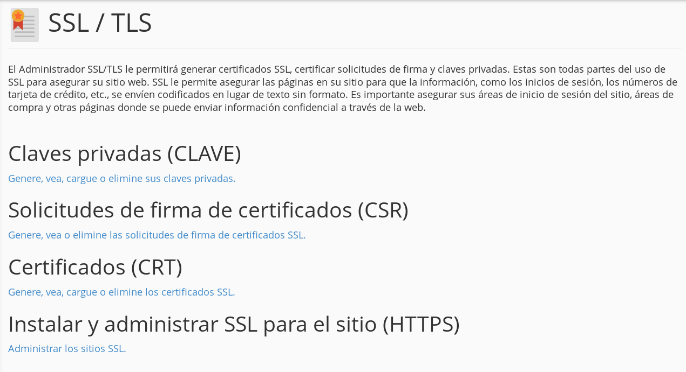
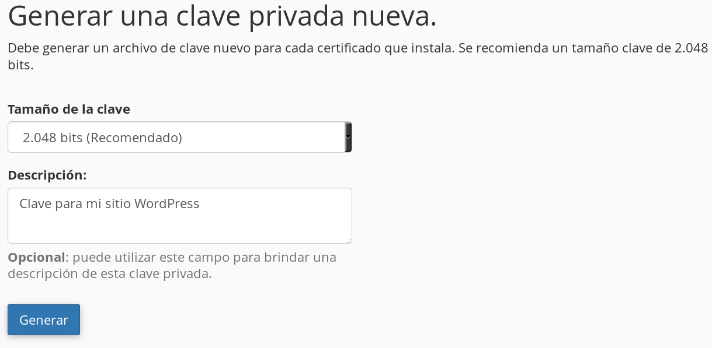
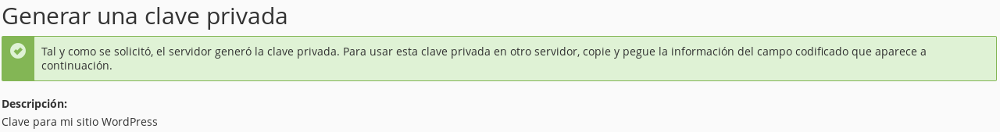
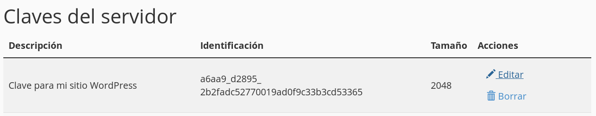
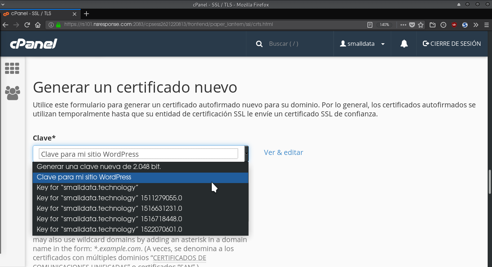
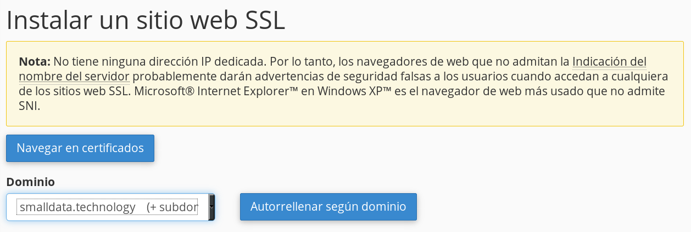

# Guía de seguridad para Wordpress

## Tabla de contenidos
- [Introducción](#id-section1)
- [Descripción](#id-section2)
- [Antes de instalar WordPress](#id-section3)
  - [Dominio](#id-section4)
  - [Servidor](#id-section5)
    - [¿Como elegir un servidor?](#id-section6)
    - [Activar HTTPS para tu sitio Wordpress (certificado SSL)](#id-section7)
  - Protege tu sitio contra ataques DDoS
    - Introducción a DDoS y CDN
    - Cómo activar Deflect para tu sitio WordPress
- Después de instalar Wordpress
  - Actualizaciones
  - Configuración de la base de datos
    - Usuarixs y contraseñas de la base de datos
    - Cambiar el prefijo de WP
  - Configuración del sitio WordPress
    - Inicio de sesión
      - Personaliza tu inicio de sesión
      - Activa la verificación de 2 pasos
      - Desconecta automáticamente lxs usuarixs no activos
    - Configuración adicional de Seguridad
      - Remover la versión de Wordpress
      - Proteger tu configuración de WordPress usando htaccess
  - Respaldar y restaurar
    - Sobre los respaldos
    - Respaldar archivos de WordPress y la base de datos
      - La opción manualmente
  - Checklist de seguridad de WordPress

## Introducción {#id-section1}

Actualmente WordPress es el CMS (sistema de gestión de contenidos, por sus siglas en inglés) más utilizado del mundo, casi 30% de las páginas de Internet  lo utilizan como su sistema de publicación de contenidos por su facilidad y versatilidad ([W3Techs](https://w3techs.com/technologies/overview/content_management/all/), enero 2018)

Al ser tan popular es también la plataforma más atacada. Con esta Guía de seguridad para WordPress podrás incrementar los niveles de seguridad de tu sitio web y blog.

## Descripción {#id-section2}

Esta guía contiene recomendaciones para reforzar la seguridad de tu página WordPress bajo tres principios de seguridad informática:

- **Mínimo privilegio**, consiste en dar a los usuarixs y aplicaciones la menor cantidad de permisos  posible para que realicen sus actividades.
- **Mínima superficie de vulnerabilidad**, consiste en reducir al mínimo los puntos de ataques expuestos.
- **Defensa en profundidad**, consiste en utilizar medidas o reglas de seguridad que no anulen o se contrapongan a otras ya establecidas, todas las medidas implementadas deben poder coexistir.

Fuente : [Máxima Seguridad en WordPress](https://0xword.com/es/libros/84-maxima-seguridad-en-wordpress.html)

Esta guía toma en cuenta las versiones de WordPress de WordPress.org , y no las de WordPress.com.

La diferencia entre WordPress.com y WordPress.org es que WordPress.com es un servicio comercial de blogs que usa la versión de código abierto y gratuito distribuida por WordPress.org

## 1. Antes de instalar WordPress {#id-section3}

Esta primera parte de la guía tiene como objetivo darte una perspectiva de los elementos y configuraciones a tomar en cuenta antes de instalar el CMS.

Es recomendable realizar estas configuraciones desde el momento de la instalación ya que permite tomar medidas de seguridad para los sitios. Esto beneficia las siguientes etapas del proceso de configuración de Wordpress.

Es una realidad que las contraseñas son el corazón de tu vida digital, por lo que es importante adoptar hábitos de seguridad para que éstas siempre sean seguras.  A lo largo de la guía crearemos varias contraseñas para diversos servicios y configuraciones; te recordamos que sean contraseñas seguras.

> *Una contraseña se considera segura cuando es: única, privada, larga, combina números + letras + símbolos y tiene caducidad*

---
**Consejo:** Te recomendamos utilizar un [gestor de contraseñas](https://infoactivismo.org/que-es-un-gestor-de-contrasenas-y-para-que-sirve/) como keepassXC o Last Password para gestionarlas y no exista un riesgo de perderlas o de olvidarlas.

---
## Dominio {#id-section4}

El nombre de un sitio como socialtic.org se le conoce como Nombre de Dominio.

El nombre de dominio es asociado a una dirección IP (e.g. 74.125.196.105). El nombre de dominio y la dirección IP te llevan al mismo sitio, la diferencia es que el dominio es para los humanos y la IP para las máquinas. En efecto, es más fácil recordar socialtic.org  que 74.125.196.105.

Para tu sitio WordPress necesitaŕas un dominio, este  se obtiene por medio de proveedores llamados Domain Name Provider o Domain Name Register.

Para elegir un proveedor de dominio te recomendamos considerar:

* Precio: Dependiendo del proveedor el precio puede variar. A veces el precio va incrementando con el tiempo o el tráfico que recibe tu página.
* Los Top Level Domains (TLD) disponibles: Un TLD Se refiere a la terminación de un dominio e.g. .com o .org. Te recomendamos evitar el uso de TLDs poco conocidos como .tk o .mfa que se pueden conseguir gratis. En cuanto a los TLD recomendados, puedes considerar, usar las siguientes opciones:
    * .org para una organización sin fines de lucro.
    * .com para uso general.
    * .net para una comunidad.
    * TLDs nacionales (e.g. .mx para México) para una actividad en un determinado país.
* Soporte al cliente: Recuerda investigar el soporte al cliente de tu proveedor, es importante siempre contar con servicio y atención en casos de emergencia.
* Transferencia de dominio: no todos los proveedores permiten transferir su dominio a otra página. Es decir, si más adelante necesitas elegir un servidor con mayor capacidad o si deseas cambiar de proveedor, necesitas que tu dominio acompañe este cambio y por lo tanto es buena idea verificar que tu proveedor permita transferencia de dominio hacia otra solución de hosting.

Aquí, algunas recomendaciones confiables para comprar tu dominio.
Última actualización: marzo 2018

| Proveedor | Precio anual en USD (para el primer año)    |
|-----------|--------------------------------------|
| [NameCheap](https://www.namecheap.com/) | .org: $12.48          |
| [GoDaddy](https://www.godaddy.com/domains)   | .org: $7.99 / $19.99 |
| [HostGator](https://www.hostgator.com) | .org: $9.95           |
| [BlueHost](https://www.bluehost.com)  | .com: $11.99                         |
| [eHost](https://www.ehost.com/)     | .com: $19.95                         |                |

## Servidor {#id-section5}

El servidor es el espacio en el que se guarda los datos de tu página y se accede a través del navegador web  utilizando el nombre del dominio.

Uniendo conceptos, cuando una persona se conecta a un dominio (e.g. socialtic.org) realmente se está conectando a un servidor que responde a ese nombre y el servidor entrega los datos (como las publicaciones o las fotos) que se visualizan en el navegador.

## ¿Cómo elegir un servidor? {#id-section6}

Hay muchas opciones de hospedaje en línea y puede ser un poco abrumador buscar uno por uno. Si algunos proveedores tienen mejor reputación que otros no significa que haya uno mejor que todos, sino que cada proveedor tiene soluciones adaptadas a cierto tipo de organizaciones.

Para encontrar el servidor que mejor te conviene puedes considerar los siguientes criterios.

- Primero, hay dos grandes tipos de hospedaje, servidores compartidos o servidores privados virtuales (VPS, Virtual Private Server):
  - Una **VPS** es una solución recomendada para personas familiarizadas con el funcionamiento de sistemas operativos. La idea es que puedas administrar un sistema operativo y los diferentes elementos necesarios para tener un sitio web en línea (e.g. servidor web, gestor base de datos, php, etc) de forma manual y a distancia.
  - El **servidor compartido** es el más común, después de contratar el servicio, tendrás un usuario y contraseña  para acceder a un panel de administración (generalmente uno llamado cPanel). Desde este panel se pueden realizar varias configuraciones como instalar WordPress o asociar un dominio con tu sitio.

  Esta guía se enfoca en el uso de servidores compartidos por ser los más asequibles y fáciles de manejar.

**Elementos basicos para elegir un servidor adaptado a tu organización**

- Costo mensual: A diferencia de un dominio, los servicios de hospedaje se pagan mensualmente y el precio es el mayor  determinante de los criterios más abajo.
- Características físicas.
  - Tamaño de disco duro : Dependiendo del uso del sitio los requerimientos pueden variar, por ejemplo si cuentas con contenido y videos vas a necesitar más espacio que un blog de artículos con sólo texto. Mientras más contenido multimedia tengas, mayor espacio requerirás.
  - Número de visitas : Para el proveedor de servicio, más tráfico en la página significa más uso de ancho de banda, lo que implica un límite de visitas para no exceder el ancho de banda contratado.
- Componentes adicionales.
  - Número de sitios: Usualmente los planes que se contratan permiten varios sitios almacenados en el servidor, si vas a administrar más de un sitio esto puede ser importante.
  - Correo electrónico: Con el servidor se puede tener adicionalmente un servicio de correo electrónico. Esto permite darle a la organización un canal de comunicación específica con la ventaja que el email contenga el nombre del dominio de la organización. Por ejemplo : contacto@socialtic.org .
  - CDN and SSL: Estos dos componente son de seguridad y los explicaremos en detalles más adelante. Si están incluidos mejor, y también se pueden configurar manualmente como lo mostraremos más adelante.

## Activar HTTPS para tu sitio Wordpress (certificado SSL) {#id-section7}

Un certificado de SSL (Secure Sockets Layer) es una herramienta que permite que la información viaje de manera segura (cifrada) hacia nuestro sitio. Por ejemplo, cuando alguien se registra en algún sitio suele llenar un formulario con datos con su nombre, email y contraseña. Estos datos viajan de la computadora de la persona al servidor donde se encuentra el sitio para ser almacenados en alguna base datos.

Implementar un certificado SSL para migrar una página a HTTPS ¡no es opcional!

Recientemente Google ha decidido sancionar las páginas sin HTTPS de varias maneras, primero, en la búsqueda, las páginas que no tienen certificado no aparecerán en los primeros resultados, también añade un mensaje advirtiendo que el sitio no es seguro.

Si al visitar un sitio aparece un candado verde y la URL dice https, los datos que se están enviando del navegador al servidor se encuentran viajando de manera segura (cifrada) evitando ser interceptados y/o leídos por alguien más.

Usualmente los certificados de SSL son provistos como un servicio de paga, sin embargo existe una alternativa gratuita y confiable llamada [**Let’s Encrypt**](https://letsencrypt.org/). Te recomendamos revisar las condiciones de uso de tu proveedor de hosting para averiguar si tiene compatibilidad con Let’s Encrypt. Usualmente tu proveedor de hosting incluirá una solución de certificados SSL por defecto.

La diferencia entre Let’s Encrypt (gratis) y proveedores de certificados pagados como Comodo, o GeoTrust RapidSSL, es el número de opciones disponibles. Con opciones pagadas se  puede tener certificados con mayores estándares de verificación.

También permiten tener certificados válidos durante 1 año mientras Let’s Encrypt tiene certificados válidos solamente 90 días (aunque se puedan renovar automáticamente).

Por último, Let’s Encrypt no proporciona seguros en caso de brecha de seguridad como otros servicios de paga.

Para activar un certificado SSL y habilitar HTTPS en tu sitio, dirígete a tu cPanel y realiza los siguientes pasos:

1. En el cPanel busca la sección SSL/TLS , a veces también llamada Certificados. Si no aparece ponte en contacto con tu proveedor para averiguar las opciones.

2. Da clic a Claves privadas (CLAVE)

3. Deja el tamaño de la clave por defecto (2048 bits) a menos que tengas alguna restricción particular, luego escribe una descripción para tu llave y da clic en el botón de Generar. Aparecerá un mensaje de confirmación con tu clave abajo así como una la lista de claves.

4. Regresa a la sección SSL/TLS y da clic en Certificados (CRT). Baja hasta Generar un certificado nuevo, elige tu clave generada en el paso 3 y llena los datos que se te solicitan, da clic en  el botón Generar.

5. A continuación, tienes que hacer clic en Instalar y administrar SSL para el sitio (HTTPS), bajar hasta Instalar un sitio web SSL, elegir tu dominio y hacer clic en el botón de autorelleno. Para terminar da clic en Instalar certificado.  

6. Cuando termine de cargar habrás habilitado HTTPS en tu servidor y tu página será segura.

Normalmente, el proceso de activación de HTTPS puede tardar de 10 a 15 minutos, por lo que no te preocupes si al intentar acceder a tu web no ves todavía el protocolo HTTPS activado. En cuanto pase ese lapso de tiempo, toda tu web será segura y no tendrás que hacer nada más.
