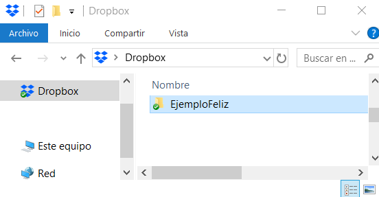
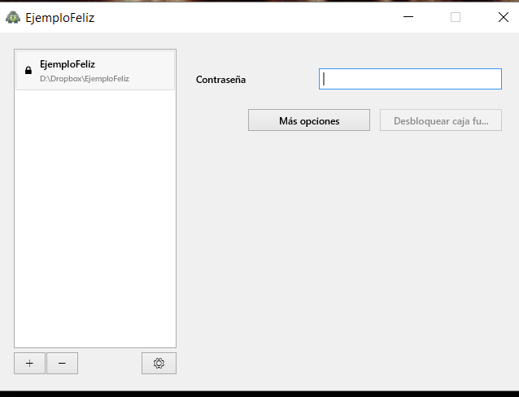

Cryptomator

# Una opción para cifrar los archivos que guardas en línea

Cryptomator es una herramienta que cifra tus archivos y te permite sincronizarlos entre dispositivos a través de la nube o unidades USB de manera segura. Esto es útil cuando se trabaja con información privada o sensible, ya que nos permite cifrar la información (volverla ilegible) para que sea consultada solamente cuando así lo deseemos y tenerla sincronizada en distintos dispositivos. Un ejemplo de ello puede ser sincronizar o compartir información en la nube sobre datos contables, investigaciones, información interna de un equipo de trabajo, testimonios, etc, y queremos que esta información viaje de manera segura pero sin detener nuestra labor e interacción en Internet.

Cryptomator es una opción de Software Libre, por lo que está en desarrollo constante y es una alternativa gratuita (si deseas apoyar proyectos de código abierto como este, puedes donar :), no te pide crear una cuenta y hacer login y está disponible para Windows, Mac, GNU/Linux, Android y iOS; por lo que puedes cifrar archivos desde tu computadora, tablet y celular.

Descarga Cryptomator desde su sitio oficial [https://cryptomator.org/downloads](https://cryptomator.org/downloads).

# ¿Cómo funciona Cryptomator?

Para cifrar los archivos, Cryptomator permite crear *caja fuertes (vault)* y montarlas en "la nube" para que puedan estar sincronizadas. Para comprender cómo funciona, ten en cuenta estos dos momentos:

* Lo primero es crear una caja fuerte, lo que significa generar una carpeta desde tu computadora, (usualmente en una carpeta en Dropbox, Google Drive, iCloud, o servicios parecidos) en donde estará tu contenido cifrado.

* El segundo momento, es cuando le indicas a Cryptomator que active la caja fuerte como si fuera una USB, de tal modo que la caja fuerte se descifre y te permita manejar los archivos; cuando termines de usarlos, de nuevo podrás indicarle a la caja fuerte que se expulse (como si fuera un USB), y todo volverá a estar cifrado y sincronizado.

Lo anterior puede sonar un poco complicado con puro texto, así que te mostraremos cómo se realiza todo el proceso anterior. Los pasos que se muestran fueron realizados en Windows 10, sin embargo aplican de igual manera en Mac y GNU/Linux.

# Creando una caja fuerte

Para crear una caja fuerte:

* Abre la aplicación.

* Haz clic en el icono de ‘+’.

* Selecciona "Crear una nueva caja fuerte".

* Selecciona la ubicación de la carpeta donde se almacenará nuestra caja fuerte, en este caso será una carpeta de Dropbox.

* Ingresa la contraseña de la caja fuerte. Recuerda usar contraseñas seguras y guardarlas con ayuda de un gestor de contraseñas; ya que si olvidas o pierdes la contraseña no podrás acceder al vault de nuevo.

* Selecciona "Crear caja fuerte".

Una vez creada la caja fuerte, verás que ahora se encuentra listada, y ahora puedes seleccionarla, ingresar la contraseña y manipular tu contenido y archivos.

En caso de tener más de una caja fuerte, estas se listan en el mismo lugar para que puedas acceder a ellas.

Si en este momento accedes desde el explorador de archivos a la caja fuerte que has creado, verás que existen tres elementos, dos carpetas y un archivo.

Así es como verás la información contenida en la caja fuerte, y cuando se sincronice a la nube, no se verá el contenido como tal, solo se verán estos tres elementos. Es importante mencionar que no debemos modificar estos archivos para no dañar el contenido cifrado de la carpeta.

# Usando una caja fuerte

Para almacenar información en la caja fuerte y que esta se cifre es necesario indicarle a Cryptomator que deseas trabajar con ella.

Para eso, sigue los siguientes pasos:

* Selecciona la caja fuerte con la que quieras trabajar.

* Introduce la contraseña.

* Selecciona "Desbloquear la caja fuerte".

Verás que automáticamente se abre una ventana nueva en tu explorador de archivos, y que la interfaz de Cryptomator ha cambiado.

La carpeta que se ha abierto es la caja fuerte que has creado antes, y ahora tiene la capacidad de funcionar como una carpeta normal, y está lista para almacenar tus archivos.

Dependiendo del tamaño y del contenido de los archivos que almacenes, Cryptomator te mostrará si la información se está cifrando o descifrando conforme la utilices, (esto es útil para conocer el rendimiento que tiene en tu equipo). Considera que en el caso de archivos muy grandes o equipos muy viejos, este proceso puede demorar algunos segundos extra.

Cuando hayas terminado de trabajar con tu caja fuerte, cierrala y bloqueala. 

Sigue estos pasos:

* Cierra la ventana del explorador de archivos.

* Selecciona "Bloquear caja fuerte".

Así habrás cerrado y bloqueado tu caja fuerte, es como si hubieras expulsado de forma segura una USB. De esta manera tus archivos se encuentran cifrados y sincronizados de manera segura en la nube.

En caso de recibir un mensaje de error, asegúrate que has cerrado todos los archivos y carpetas de la caja fuerte, incluyendo la carpeta que te permite visualizar los archivos, esto evita forzar el cierre y que tu información pueda dañarse.

# Abriendo una caja fuerte existente

Una vez que tengas tu caja fuerte sincronizada a la nube, puedes abrirlas con Cryptomator en otros equipos, para ello:

* Haz clic en el ícono de ‘+’.

* Selecciona "Abrir una caja fuerte existente".

* Busca la carpeta de tu caja fuerte y selecciona el archivo *masterkey.cryptomator*.

Con eso aparecerá tu caja fuerte en la interfaz de Cryptomator y podrás utilizarla como vimos antes.

Como recomendación final te invitamos a que utilices herramientas como Cryptomator que permiten manejar la información de manera cifrada y que no permiten que otrxs husmeen tu información.

Si tienes dudas específicas sobre cómo utilizar Cryptomator o sobre alguna plataforma distinta a Windows (Mac o GNU/Linux) no dudes en escribirnos a [seguridad@socialtic.org](mailto:seguridad@socialtic.org) 

